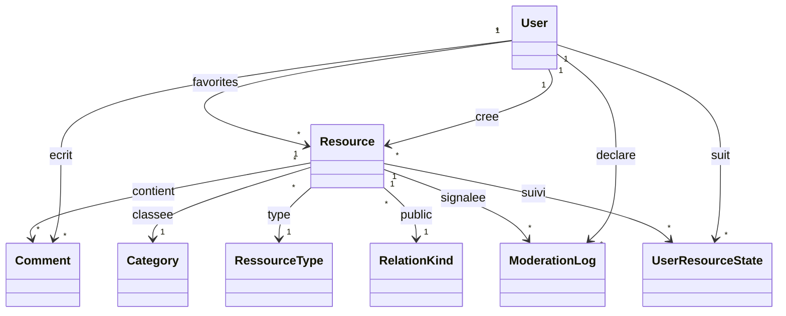
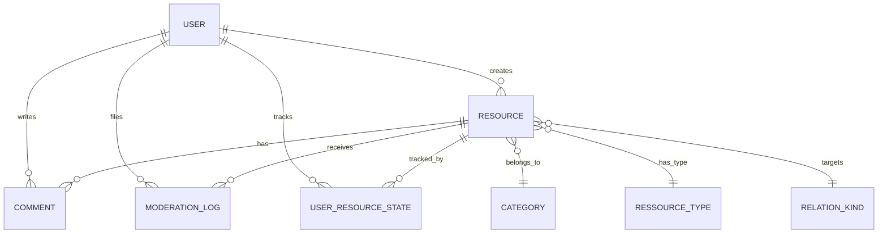

# Architecture

## Stack

- Web front/back: Symfony 7, Twig, EasyAdmin, Webpack Encore, Bootstrap
- API: API Platform + endpoints JWT custom
- Base de donnees: MySQL
- Uploads: VichUploader
- Tests: PHPUnit
- Mobile prototype: Expo / React Native

## MVC

- Model: entites Doctrine dans `src/Entity`
- View: templates Twig dans `templates`
- Controller: controleurs HTTP dans `src/Controller`

## Acteurs

- Citoyen non connecte
- Citoyen connecte et verifie
- Moderateur
- Administrateur catalogue
- Super administrateur

## Regles metier

- Ressource `private`: visible par son auteur et les equipes de moderation
- Ressource `shared`: visible par les utilisateurs connectes et les equipes de moderation
- Ressource `public`: visible par tous
- Ressource `under_review`: visible par son auteur et les equipes de moderation
- Commentaire citoyen: cree en `pending`, publie apres moderation

## Diagramme de classes simplifie

## MCD simplifie

## API pour le mobile

- `POST /auth/login`
- `POST /auth/register`
- `POST /api/verify-token`
- `GET /api/resources.json`
- `GET /api/resources/{id}.json`

## Accessibilite et qualite

- interface responsive
- pages legales
- aide utilisateur
- verification email avant publication et interactions
- separation des droits moderation / catalogue / gouvernance
